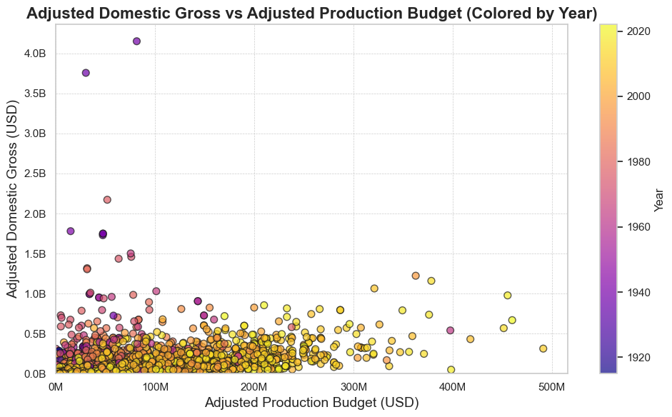
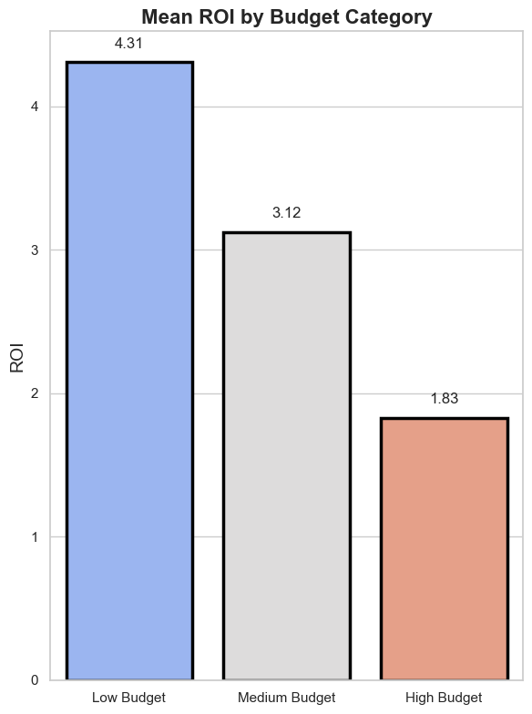
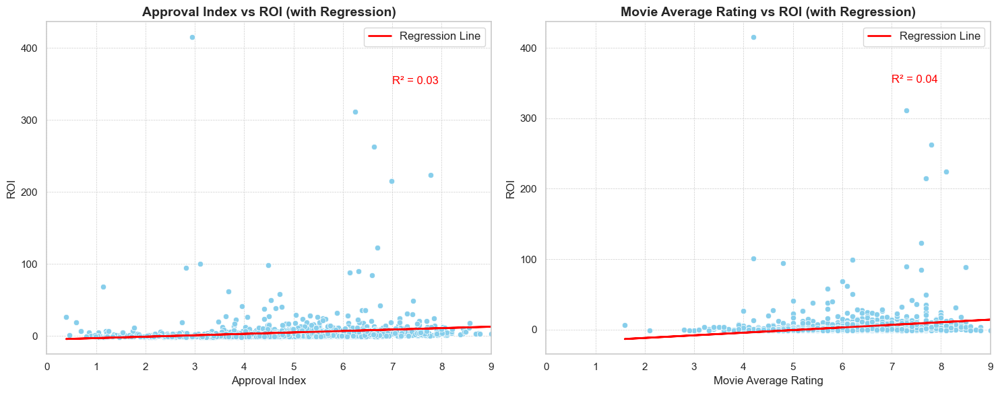
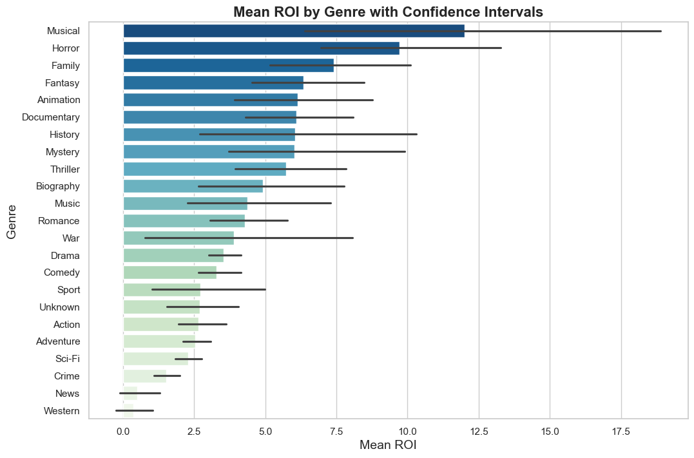
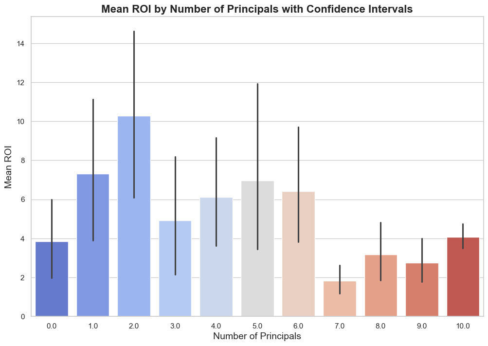

# A Guide to Box Office Success

Authored by Elif Surucu & Ricky Bocek

## Instructions Before Proceding

All datasets used in this analysis are available in the Data.zip file - just unzip in place to use our project. The unzipped folder is already listed in the .gitignore to avoid errors with trying to upload the IMDb sqlite database file to GitHub, as it is too large when not compressed.

## Project Overview

This analysis of movie data, sourced from Kaggle, The Numbers, and IMDb, investigates the financial success of movies by analyzing the risk-reward relationship between production budget and profitability, adjusted to the yearly Consumer Price Index. This analysis leverages historical movie data to identify patterns and key features, such as genres, directors, and number of principals, that correlate with higher profitability. By applying statistical techniques like ANOVA and linear regression, the project uncovers which genres and budget categories lead to the most successful movies. Additionally, the project offers recommendations for future movie production, focusing on maximizing ROI based on these identified success factors.

## Business Understanding

The movie industry operates in a highly competitive environment where production companies aim to maximize profitability while minimizing financial risk. However, predicting the financial success of a movie is challenging due to various factors like genre, budget, cast, and market trends. This project seeks to address this uncertainty by identifying the key features that drive higher returns on investment (ROI) for movies. The goal is to provide movie studios and producers with actionable insights to optimize their budgets and make informed decisions about which genres, directors, and budget levels are more likely to result in profitable outcomes. By analyzing historical data, the project can help studios focus their resources on the most promising projects, thereby improving financial performance in an unpredictable market.

## Data Understanding

Project data sources:

* [IMDb](https://www.imdb.com/)
* [The Numbers](https://www.the-numbers.com/)
* [Kaggle - The Ultimate Film Statistics Dataset](https://www.kaggle.com/datasets/alessandrolobello/the-ultimate-film-statistics-dataset-for-ml/data)
* [US Bureau of Labor Statistics](https://www.bls.gov/)

This project combines movie budget and earnings sourced from Kaggle and The Numbers with an IMDb dataset of production elements to create a feature-rich list of over 5700 movies with financial metrics, using historical Consumer Price Index (CPI) tables from the US Bureau of Labor Statistics to adjust dollar values for inflation. Key data fields include genres, production budgets, domestic and worldwide gross earnings, and director. The project focuses on maximizing ROI to evaluate the financial success of movies, while accounting for risk as determined by production budget.

When evaluating the following recommendations, it is crucial to keep in mind that our data can *only* account for projects that actually survive to release and distribution. This analysis can help inform what projects to pursue, but none of this - aside, possibly, from director selection - is relevant to the task of assuring that a film actually comes to fruition.

## Data Preparation

To ensure accurate analysis, we addressed missing values, removed duplicates, and ensured data consistency across all relevant fields. We merged datasets (movies, directors, and others) based on movie_id and person_id to consolidate essential information like gross earnings, genres, and director. We derived inflation-adjusted budget and revenue values to account for dollar value change over time and calculated ROI to allow comparison of success between vastly different budget levels. We split multi-genre entries to analyze each genre's impact separately on metrics like ROI. We filtered directors based on relevant criteria to ensure all recommendations remained actionable and cohesive.

## Analysis and Recommendations

We started by comparing adjusted gross revenue to adjusted budget then added linear regression to look for direct correlation. We expanded on the analysis by comparing ROI by budget category and then by two measures of acclaim. Then perfomed ANOVA tests looking for significant differences in ROI by genre or number of principals and characterized the differences we found with a post-hoc Tukey HSD test.

This exploratory visualization of the data emphasizes the significant variance in gross earnings and, consequently, in return on investment (ROI). The color scale indicates that more recent films (yellow and light orange) tend to have higher production budgets than older films (purple), reflecting expansion and capitalization of the industry. Given the high variance in gross revenue and the fact that our top revenue outliers are not the same as our top budget outliers, a logical question followed: "IS there a relationship between budget and gross revenue?"

From the regression, we observe that for each (adjusted) budget dollar spent, there is an average expected revenue of $3.19 (in 2022 dollar value), with budget driving as much as 30% of the variance (an R-squared of ~0.3).

However, when analyzing budget categories, we notice that high-budget films have a diminished ROI compared to low-to-medium budget films, so the relationship is apparently not entirely linear. Increasing the budget within reasonable limits is an effective strategy for maximizing revenue, but due to diminishing average ROI and the previously-stated limitations in the data, managing risk exposure is still key - it's more worthwhile to be comfortably able to make *and release* several low-budget films than to over-extend for a higher budget film.

Both the approval index and movie average rating have very weak positive correlations with ROI, with R-squared values of 2.6% for Approval and 4% for Ratings.
The relationships are small but present, as indicated by the positive slopes of both regression lines. However, the high dispersion of the data (especially in the ROI outliers) suggests other factors may have a stronger influence on ROI. In general it is recommended to ignore ratings as an avenue to ROI.

ANOVA test across genres allowed us to determine that there WAS a significant difference in mean ROI between genres. Following up with a post-hoc Tukey HSD test allowed us to describe which categories performed significantly better or worse than others. This bar plot clearly mean ROI differences between various movie genres, with error bars to assess the overall condience interval. This helps pinpoint which genres tend to perform better or worse in terms of ROI. For example, our data shows a good degree of confidence in the mean ROI for horror films, our second-highest performing category, but some high-performing genres, like musicals, are not as well-represented in the data, so they exhibit wider confidence intervals. Even so, musicals still rank among the genres with the strongest average ROIs and may still also be a good option. Family represents the third tier with smallest confidence interval of the top three and strong mean ROI as another emminently reasonable choice depending on other production factors.

This visualization helps identify which specific groups of principal counts perform better or worse in terms of ROI. The confidence intervals allow us to assess which principal counts significantly differ from each other in terms of financial performance. Specifically we see that 2 principals has signficiantly higher mean ROI than 7-10 principals with 95% confidence, and has the highest mean ROI overall, so it seems likely that a "dynamic duo" can boost a film's appeal, while a large principal cast is more risky.

## Conclusion

* While larger budgets can lead to higher gross earnings, our analysis shows that ROI diminishes as budgets increase. High-budget films tend to offer lower returns compared to low- to medium-budget productions. It's essential to strike a balance—allocate enough resources to ensure quality, but avoid overspending, as the additional costs may not be justified by the returns.

* High ratings, including approval indexes and average ratings, have minimal impact on ROI. Focusing too much on achieving critical acclaim may not be financially beneficial. Instead, prioritize optimizing production costs and investing in genres with a proven track record of profitability to drive financial success.

* Genres such as Horror, Musicals, and Drama consistently deliver higher ROI. Concentrating on these top-performing genres allows filmmakers to maximize returns while minimizing financial risk. Sticking to genres with a strong track record is a more reliable strategy than experimenting with less proven options.

* Films with smaller principal casts, particularly dynamic duos, tend to deliver better ROI than productions with large casts. Large ensembles generally don’t result in higher returns, whereas dynamic duos offer broad appeal and can be produced more efficiently.

* Working with directors who have a successful track record, especially within key genres like Horror, Drama, and Musicals, significantly increases the chances of a high ROI. Directors with experience in low- to medium-budget films bring industry expertise and genre-specific knowledge that align with the financial goals of the project.

## Next Steps

Several features in the IMDB dataset have yet to be thoroughly analyzed, offering significant potential for deeper insights. The next step should involve exploring these untapped features to uncover new patterns and relationships. By combining these features into a more comprehensive model, we can enhance the overall analysis and increase the accuracy of our predictions.

Additionally, incorporating more detailed production elements—such as crew experience, shooting locations, and marketing strategies—alongside economic and cultural context will provide a richer understanding of what drives a movie's success. For example, understanding how cultural trends or economic conditions at the time of release impact box office performance could yield valuable insights.

Expanding the analysis in these ways will allow for more nuanced conclusions and help identify the key factors that contribute to a movie's financial and critical success.
